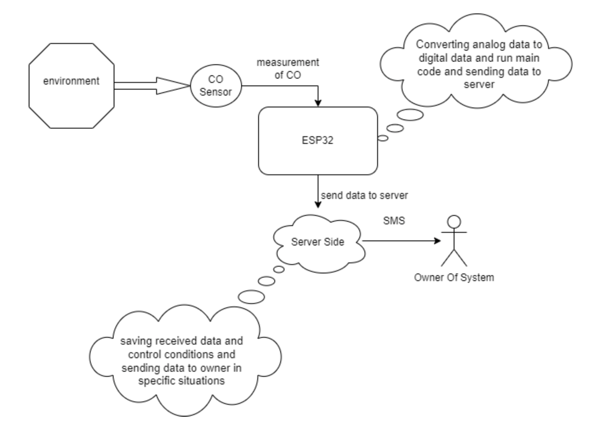
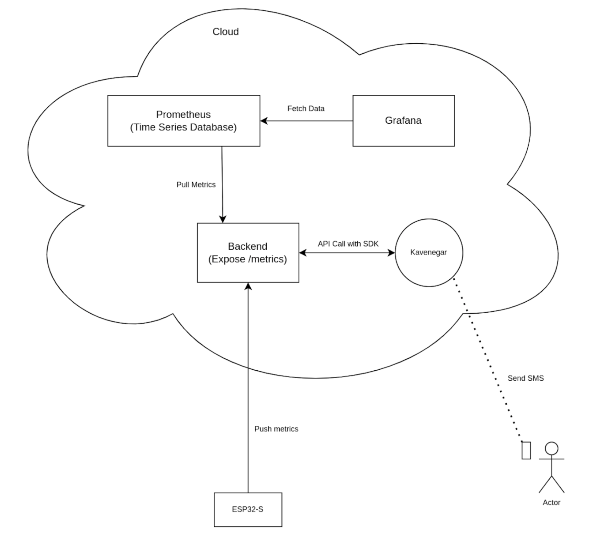
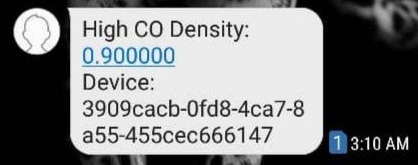
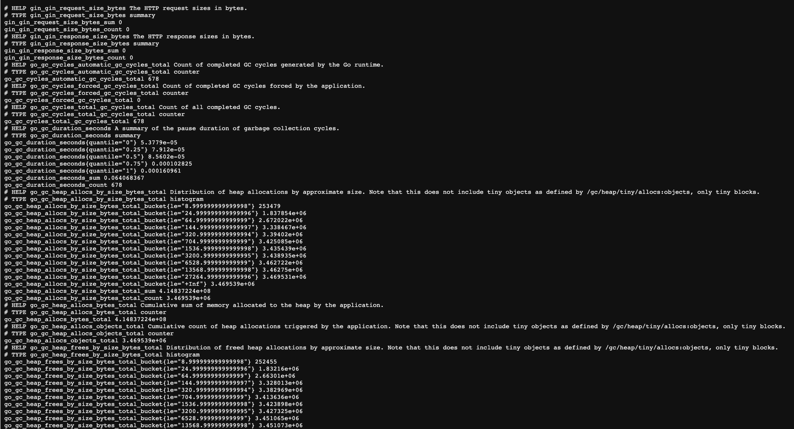
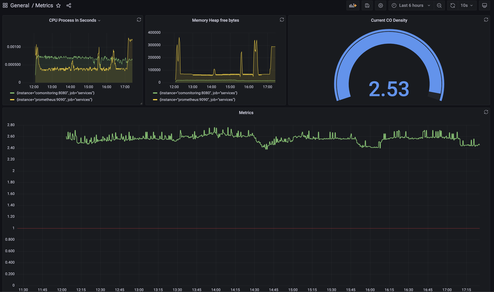

# CO Monitoring System

It's the backend repository for the IUST embedded project 2022.

## Overview

This repository consists of a simple Golang server (using the Gin framework), Prometheus, and Grafana service. You can run these services with docker-compose.

```bash
sudo docker-compose up --build
```

Here are the services

- The web server has an API for pushing CO metrics. The esp32 devices calculate the amount of CO in the air and call the server API.
- The Prometheus is a time-series database used for storing metrics for our esp32 devices.
- The Grafana provides a user-friendly interface to query the Prometheus data and visualize the data in different kinds of charts and diagrams.

## Architecture

Each device in our system has two unique UUIDs, One for the device itself and the other for the device organization.

The primary metric is CO density, but we can extend our metrics using this architecture. In this system, we can filter metrics by devices or by their organizations. The Grafana can plot these diagrams.



By calling this API, we specify the device, its organization, and the current CO density.

**Note**: These UUIDs should be immutable in the production environment (e.g., using a security chip). They should also have a private token to communicate with the cloud.



After calling this API, the server compares the given amount with the threshold and sends an alert to the user. It uses a cache to avoid sending the signal one after each other at short intervals. It has a cool-down mechanism for sending SMS. (e.g., it won't send any notifications for the next 10 minutes.)

<p align="center">
  
</p>

### Metrics

The server exposes the metrics in /metrics. The metrics include the service and device metrics.



The Prometheus pulls these metrics with configurable intervals and saves them in its database.

### Visualization

You can create your dashboard using Grafana and use functions such as avg(), min(), max(), min(), rate(), and so on to plot the aggregated data.




